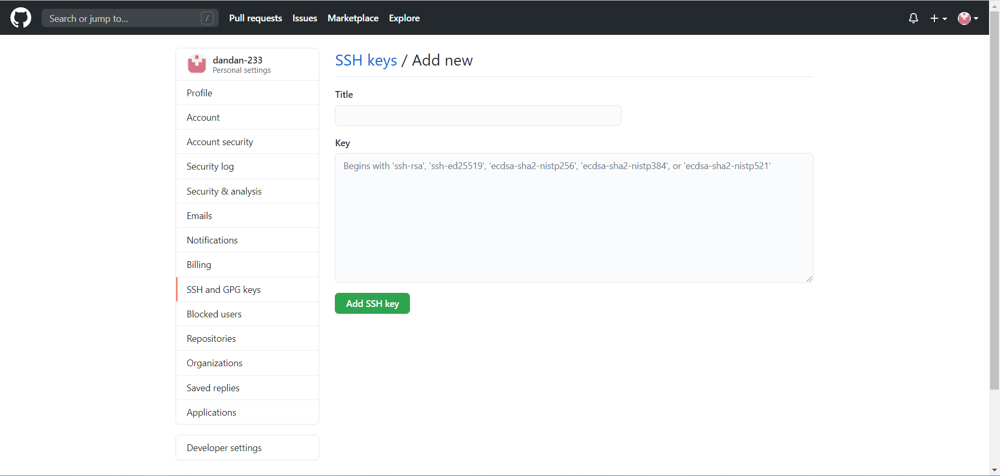

# 两个GitHub账号本地配置和使用(Local configuration and use of two GitHub accounts)

为了写笔记重新申请了新的github账号,所有有了两个github账号
只有一个github账号时,使用全局配置git信息
```
git config --global user.name '名称'
git config --global user.email 'git注册邮箱'
```
使用 HTTPS 方式管理文件
## 问题 两个github账户直接使用HTTPS出错
在部署文件(更目录deploy.sh)中直接使用HTTPS时发生错误
错误提示
`remote: Permission to dandan-233/dandan-233.github.io.git denied to yunpengGit.
fatal: unable to access 'https://github.com/dandan-233/dandan-233.github.io.git/': The requested URL returned error: 403`

## 设置SSH密钥 将SSH密钥添加到Github账户
创建多个秘钥自定名称区分
``` bash
cd ~/.ssh
ssh-keygen -t rsa -C "github注册邮箱"
```
新生成的文件id_rsa_dan, id_rsa_dan.pub和默认不自定义名称生成的id_rsa, id_rsa.pub四份文件,分别对应两个账号

**配置ssh秘钥config**
```bash
cd ~/.ssh
# 创建config文件
```
config内容
```
# 个人github配置
Host peng
    Hostname ssh.github.com
    User github注册邮箱
    PreferredAuthentications publickey 
    IdentityFile "对应的sshkey文件"
    Port 443
# 示例
Host dan
    Hostname ssh.github.com
    User 1471947564@qq.com
    PreferredAuthentications publickey 
    IdentityFile "C:\Users\Admin/.ssh/id_rsa_dan"
    Port 443
```

添加ssh到github步骤
1. 复制本地sshkey
```bash
cd ~/.ssh
cat 文件名称
# 示例打开直接复制
cat id_rsa_dan
```

2. 到github添加秘钥目录


3. 复制秘钥添加秘钥title


## 把专用密钥添加到ssh-agent的高速缓存中
``` bash
ssh-add id_rsa_dan
```
** 执行ssh-add时出现Could not open a connection to your authentication agent ** 使用命令
```bash
ssh-agent bash
```

查看当前秘钥列表,
``` bash
ssh-add -l
```

测试以确保Github识别密钥

```
ssh -T dan(config配置Host)
```

## git远程仓库链接地址

```
git@配置Host:用户名/仓库名.git
```

