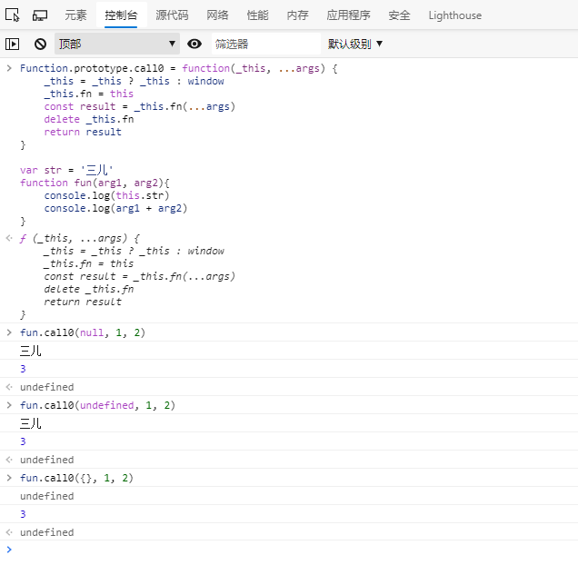

# 手写 call,apply,bind 函数实现

## call 与 apply

> call,apply都会立即执行当前的函数

### call

call() 方法使用一个指定的 this 值和单独给出的一个或多个参数来调用一个函数
#### call语法

1. 使用

```js
function.call(thisArg, arg1, arg2, ...)
```
2. 返回值

   使用调用者提供的this值和参数调用该函数,若该方法没有返回值,则返回undefined

#### call() 示例

``` js
var str = '三儿'
function fun(arg1, arg2){
    console.log(this.str)
    console.log(arg1 + arg2)
}
const _this = {
    str: '张三'
}
fun(1, 2)
// 输出
三儿
3
// 调用 call()
fun.call(_this, 1, 2)
// 输出
张三
3
```

> 补充:
>
> 因为 let, const 作用域的关系, 在声明全局变量后, 不会挂载到 window 对象上, 所以在直接调用时 this.str(全局), 返回为undefined;
>
> 使用 var 将全局声明挂载到 window 上

#### call 做了哪些事

1. 检查call()第一个参数是否为null, undefined,如果是,将 window 赋值给她;
2. 将调用call()方法的函数(也就call调用时的this),缓存为第一个对象的属性值(_this.fn);
3. 执行这个fn,带上当前的入参,缓存fn返回的结果
4. 删除_this.fn
5. return 缓存的函数调用返回结果

#### 手写实现call()

```js
Function.prototype.call0 = function(_this = window, ...args) {
    _this = _this ? _this : window
    _this.fn = this
    const result = _this.fn(...args)
    delete _this.fn
    return result
}
```

#### call0()调用测试,示例

```js
var str = '三儿'
function fun(arg1, arg2){
    console.log(this.str)
    console.log(arg1 + arg2)
}
const _this = {
    str: '张三'
}
//直接调用方法fun
fun(1, 2)
// 输出
三儿
3

// 调用 call0()
fun.call0(_this, 1, 2)
// 输出
张三
3
// 调用 call0() 第一个参数 null or undefined, {}
fun.call0(null, 1, 2)
// 输出
三儿
3
fun.call0(undefined, 1, 2)
// 输出
三儿
3
fun.call0({}, 1, 2)
// 输出
undefined
3
```



### apply

与call()区别是传参为数组

#### 手写实现 apply()

```js
Function.prototype.apply0 = function (_this, args) {
    _this = _this ? _this : window
    _this.fn = this
    const result = _this.fn(...args)
    delete _this.fn
    return result
}
```

## bind

> bind不会立即调用当前函数, 而是调用 bind 的返回函数;

返回一个新的函数，在 `bind()` 被调用时，这个新函数的 `this` 被指定为 `bind()` 的第一个参数，而其余参数将作为新函数的参数，供调用时使用

### 手写实现 apply()

```js
Function.prototype.bind0 = function () {
   var func = this
   if (typeof func !== 'function') {
     throw new TypeError("not a function");
   }
   var _this = arguments[0] ? arguments[0] : window
   var args = [].slice.call(arguments, 1);
   return function(){
   	funArgs = args.concat([].slice.call(arguments))
   	return func.apply(_this, funArgs)
  }
}
```

### apply0调用测试,示例

```js
var str = '三儿'
function fun(arg1, arg2){
    console.log(this.str)
    console.log(arg1 + arg2)
}
const _this = {
    str: '张三'
}

let fun1 = fun.bind0(_this, 1, 2)
fun1()
//输出
张三
3
let fun2 = fun.bind0(null, 1, 2)
fun2()
//输出
三儿
3

```


