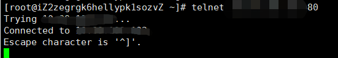

# 前端nginx服务器测试环境访问后端接口一直被挂起(pending)

## 问题描述

前端使用nginx部署到服务器,请求后端接口服务器,请求前缀为域名的形式;


## 问题分析

1. 前端项目部署初期正常访问, 没有问题,排除前端项目配置及前端服务器配置问题;

2. 查看服务器与目标服务器连通性

   ```bash
   ping 域名地址
   ping ip
   # 最重要的是 ping 端口, 使用 telnet 工具
   ```

3. 查看目标服务器, 端口是否开放

   使用 telnet 工具

   1. 安装

      ```bash
      yum install telnet –y
      ```

   2. 测试端口

      ```bash
      telnet ip 端口 #测试id地址对应端口
      telnet 域名 端口 # 测试域名对应端口
      # 返回结果为 Connected 表示端口开放
      ```

      
   
      
      
      
      
      
   
   


